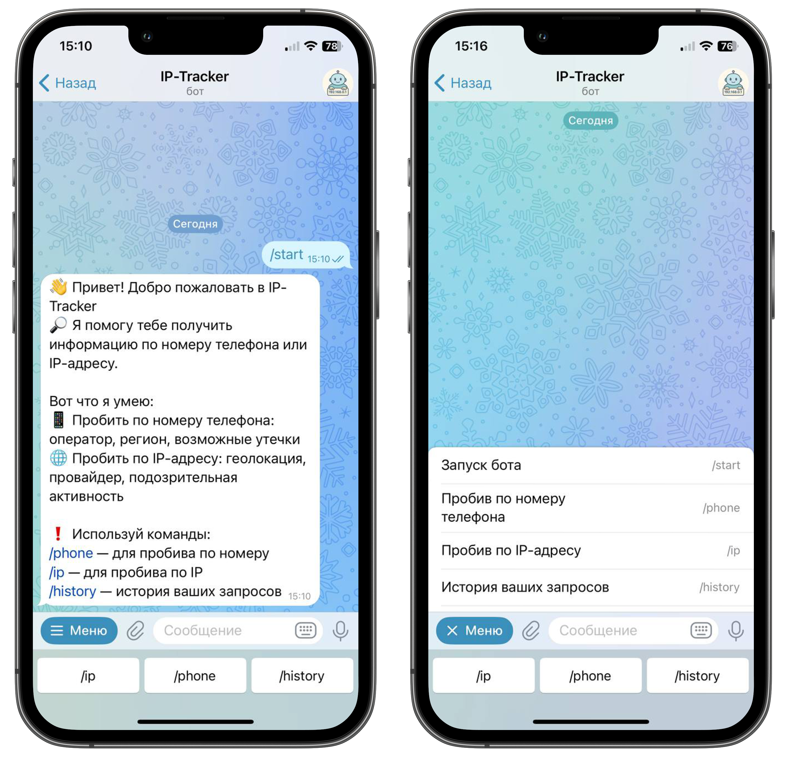

# 🔍 IP-Tracker — Telegram бот для пробива IP и телефонов

**IP-Tracker** — это Telegram-бот, который позволяет быстро получить информацию об IP-адресе или номере телефона:
страна, город, провайдер и примерное местоположение на карте.

---

## 🚀 Возможности

- 📱 Пробив по номеру телефона:
    - Определение страны и региона
    - Название оператора
    - Проверка формата и корректности номера

- 🌐 Пробив по IP-адресу:
    - Страна и город
    - Название интернет-провайдера
    - Карта примерного местоположения

- 🗂️ Логирование запросов пользователей в SQLite базу данных

---

## 🛠️ Стек технологий


---

## 📦 Установка

### 1. Клонирование репозитория

```bash
git clone https://https://github.com/finniy/IP-Tracker.git
cd IP-Tracker
```

2. Создайте и активируйте виртуальное окружение

```bash
python -m venv venv
source venv/bin/activate  # Linux/macOS
venv\Scripts\activate     # Windows
```

3. Установите зависимости

```bash
pip install -r requirements.txt
```

4. Укажите токен бота в `.env`

```bash
API_KEY=YOUR_TELEGRAM_BOT_TOKEN
```

5. Запустите бота

```bash
python main.py
```

---

## 🧠 Структура проекта

```
IP-Tracker/
├── app/
│   ├── __init__.py
│   ├── bot_instance.py
│   ├── config.py
│   ├── logger.py
│   ├── telegram_bot.py
│   ├── database/
│   │   ├── __init__.py
│   │   ├── add_in_db.py
│   │   ├── create_db.py
│   │   └── take_db.py
│   ├── handlers/
│   │   ├── __init__.py
│   │   ├── history_handler.py
│   │   ├── ip_handler.py
│   │   ├── phone_handler.py
│   │   └── start_handler.py
│   ├── messages/
│   │   ├── __init__.py
│   │   └── message_text.py
│   ├── trackers/
│   │   ├── __init__.py
│   │   ├── ip_track.py
│   │   └── phone_track.py
│   └── utils/
│       ├── __init__.py
│       ├── check_valid_ip.py
│       ├── format_requests.py
│       ├── send_map.py
│       ├── work_with_json.py
│       └── phone_codes.json
├── images/
│   ├── Photo1.png
│   └── Photo2.png
├── .env
├── .env.template
├── .gitignore
├── main.py
├── README.md
└── requirements.txt

```

## 📸 Примеры работы бота




## 📄 Лицензия

Проект распространяется под лицензией MIT. Свободно используй, дорабатывай и распространяй с указанием авторства.

---

## 👤 Автор

- GitHub: [@finniy](https://github.com/finniy)
- Telegram: [@fjnnjk](https://t.me/fjnnjk)

💌 Не забудьте поставить звезду ⭐ на GitHub, если вам понравился бот! 😉